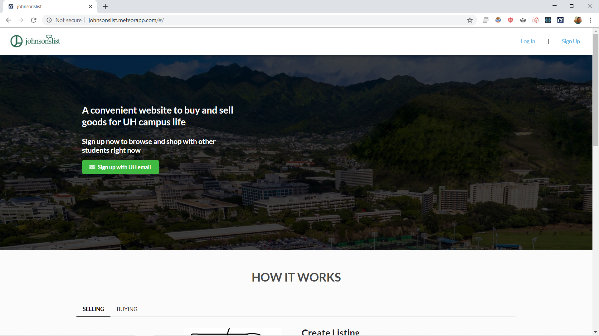
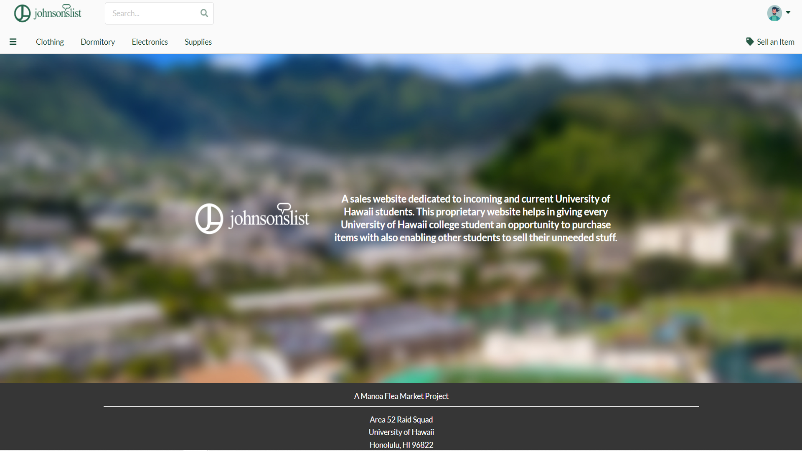
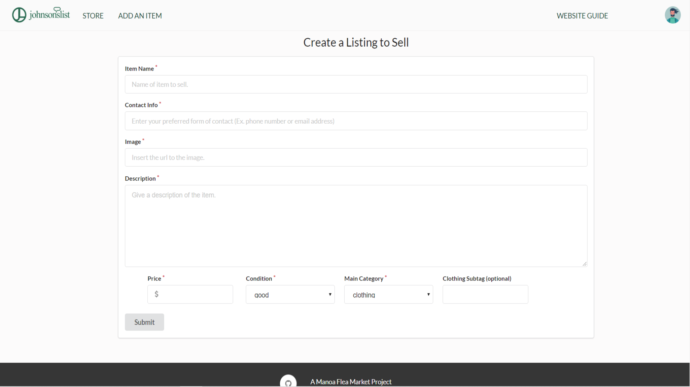
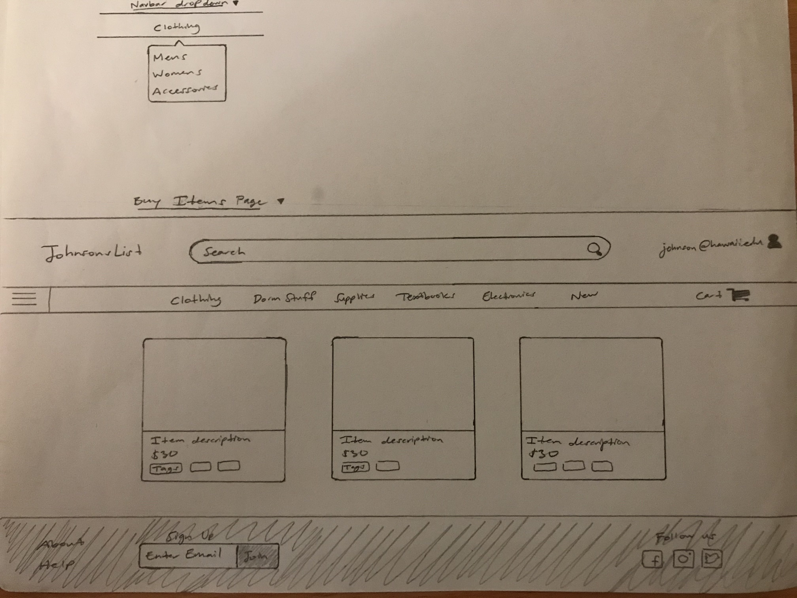
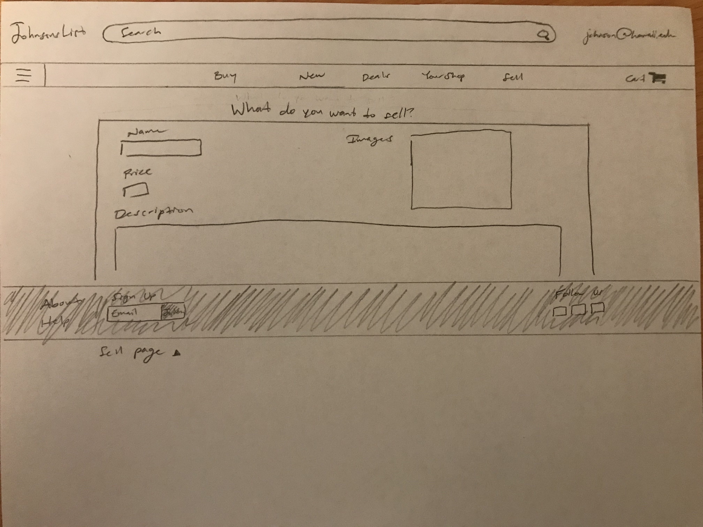
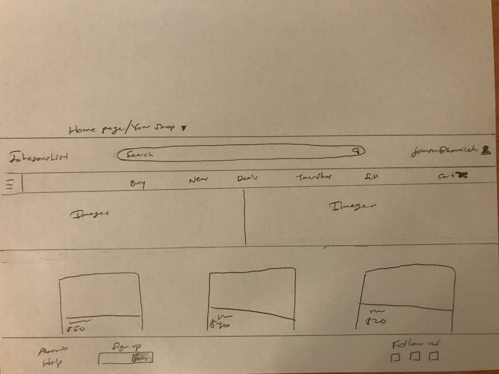
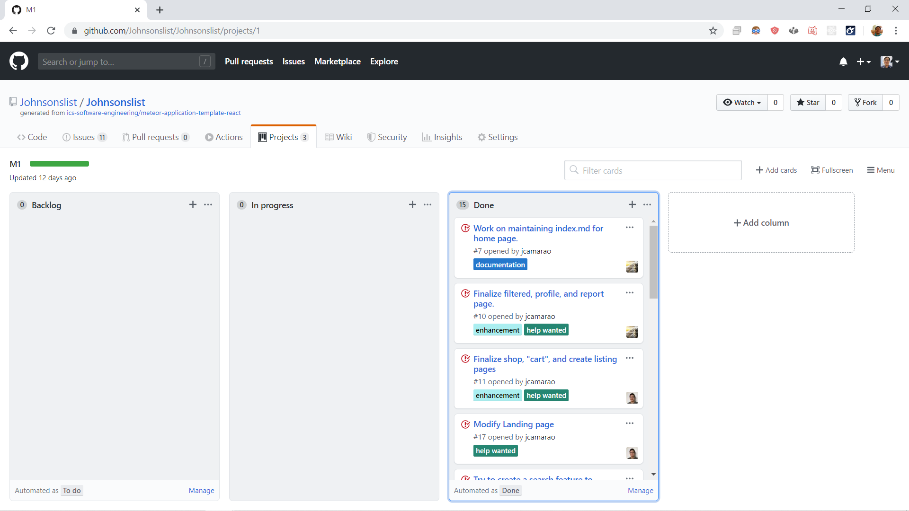

## Table of Contents
* [Overview](#overview)
* [Links](#links)
* [Functionality Goals](#functionality-goals)
* [User Guide](#johnsonslist-walkthrough)
* [Installation](#installation-and-running)

## Overview

Johnslists list is a website utilizing semantic ui, react.js, meteor, and mongoDB to create a website that can be used by undergraduate and graduate students to trade common goods. Community members of UH Manoa can add common goods, such as textbooks or appliances, that they no longer need and create listings with details about said item. 

For more information on the techstack used:
* [Meteor](https://www.meteor.com/) for Javascript-based implementation of client and server code. 
* [React](https://reactjs.org/) for component-based UI implementation and routing.
* [Semantic UI React](https://react.semantic-ui.com/) CSS Framework for UI design.
* [MongoDB](https://www.mongodb.com/) Backend Database for adding objects 

## Links

Refer to this section for the various links associated with Johnsonslist.

* [Organization Page](https://github.com/Johnsonslist/) Johnsonslist's organization page
* [Project Page](http://johnsonslist.meteorapp.com/#/) Johnsonslist's application website
* [Milestone 1 Board](https://github.com/Johnsonslist/Johnsonslist/projects/1) Issues/Goals for milestone 1 of JohnsonsList
* [Milestone 2 Board](https://github.com/Johnsonslist/Johnsonslist/projects/3) Issues/Goals for milestone 2 of JohnsonsList
* [Milestone 3 Board](https://github.com/Johnsonslist/Johnsonslist/projects/4) Issues/Goals for milestone 3 of JohnsonsList

## Functionality Goals

* Two types of users: Regular and Administrator (Both of which log in from the same page, but get directed to different home screens and contrasting functionality)
* Profiles can be customized to display a picture and a description of the person
* Add listing, edit listing, and view listings usability features (Regular users can only add/edit their own while admins can have functionality for all listings)
* Listings can be filtered depending on what specifically the user is looking for (Ex. textbooks specifically for biology)
* Users can flag or report listings that are not related to what the site's purpose is for to admins.

## Johnsonslist Walkthrough

Johnsonslist will feature a selection of pages for the user to browse. There will be a screenshot of each page below with a description of usability. For now, it displays rough mockups of what each page may or may not look like in its finalized version.

## Landing page




This is the [landing page](http://johnsonslist.meteorapp.com/#/).  This is what a new visitor first sees when they visit the site. They have the ability to see the layout of the page with the topbar and the footer, but not the shop options. They are required to log in to have those features for now.

## Home page



This is the [home page](http://johnsonslist.meteorapp.com/#/) that the users see when they log in to the site. They now have the shop options in the navbar below the top bar. The navbar also has a dropdown menu that can assist in navigating the site if they choose to navigate that way. The navbar holds the links to direct the user to the shop, their shop, their profile, saved listings, and add a listing. For now there is no search bar yet, but it is in the works to be added currently.

## Store page



The store page is the centralized location of the store where users can look at and filter through categories of items that they wish to specifically look at. 



This is a rough mock up of what the store page would look like when there are filters for what the user is looking for. There will be cards that pop up with the tags and show each item.

## Selling an item



This is what the page of selling an item may look like. So this is the page that the user sees when creating a listing to post. They will fill out a form that goes over the item and places it accordingly based on tags and functionality.



This is potentially what the intial home page of the user may look like when choosing to create a listing. It can feature all of the items they currently have up for sale so the user can keep track of what they have listed already.

## Installation and Running

To intially run the application, [install Meteor](https://www.meteor.com/install).

```
$ meteor npm install
```

From there, one must do the following command to start up the application:

```
$ meteor npm run start
```

If done correctly, the application will appear at [http://localhost:3000](http://localhost:3000). 

## Milestone 1

The goal for Milestone 1 was to implement a somewhat working web application using ReactJS, Meteor, MongoDB, and Semantic UI.  We started off by creating "rough-draft" templates of the project website.  By creating these rough-drafts, we began to cut into our creativity and functionality by asking ourselves various innovative and unique questions.  For example, what would the site cater to in the grand-scheme of things?  What would it look like?  What is the target audience for this website?  and so on.  Please click [here](https://github.com/Johnsonslist/Johnsonslist/projects/1) for more information about Milestone 1.



## Milestone 2

In developmental stage.  Coming soon!

## Milestone 3

In developmental stage.  Coming soon!

## Meet the team!

Area 52 Raid Squad:

Front-End/Back-End Development/Github.io page: Jake Camarao

[https://jcamarao.github.io/](https://jcamarao.github.io/)

Back-End Development: Kason Shiroma

[https://kasons.github.io/](https://kasons.github.io/)

Back-End Production/Development and Github.io page: Kevin Wong

[https://kwong41.github.io/](https://kwong41.github.io/)

## Feedback

If you have any questions or concerns please feel free to contact us with this [feedback page!](https://forms.gle/1T815j9Ddjxcprkx7)
